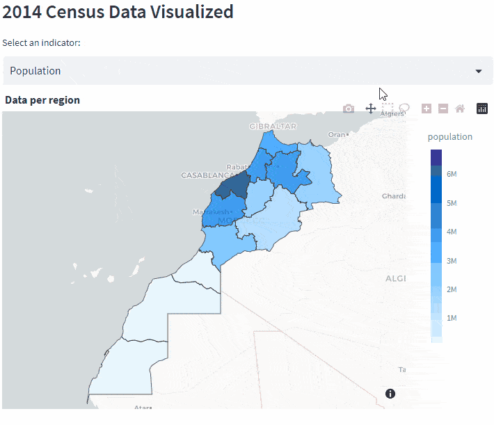

<!--  -->

[Code](https://github.com/Hassanbhb/MoroccoInData "Github repository") | [Live](https://moroccoindata.streamlit.app/)

 
  
Table of content

  - [Features](#features)
  - [Goal](#goal)
  - [Technologies used](#technologies-used)
  - [Details](#details)

Morocco in data is a web app where you can access consolidated data on Morocco's demographics, economy and more.
The data was collected from multiple sources and displayed in one place.

## Features:
  - Light / Dark mode toggle
  - Interactive charts
  - Data Visualisation
  - Data Analysis

## Goal:

The goal of this project is to make Data on Morocco available in one location and from different sources, and simplify accessiblity for all visitors.

This was a Great opportunity to solidify my knowledge of Python and learn about Data analysis, especially data visualization ( which is the fun part ).

## Technologies used:
  - **Streamlit**: A Framework which makes building and sharing data apps faster.
  - **Plotly**: Used to Visualize the data and add interactivity.
  - **Pandas**: For Data manipulation and analysis.

## Details:

I Collected the data available on Global known websites such as [World Health Organization](https://www.who.int/), [The World Bank](https://www.worldbank.org/), [National Open Data Portal](https://www.data.gov.ma/) and [Haut-commisariat au plan](https://www.hcp.ma/).

Future plans for this project are: 
- Collection of environment Data & Adding a page for it's Analysis.
- Creating Web scraping tools for automatic and faster data collection in case new data is available.